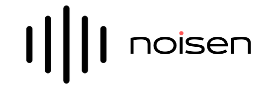
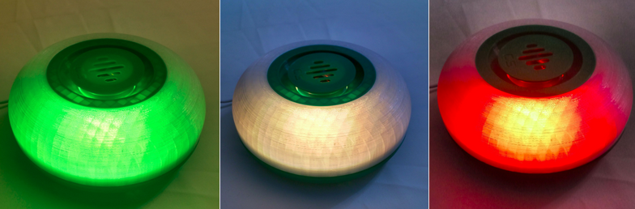

# Landing page noisen

Un dispositivo que busca **visibilizar la exposición cotidiana al ruido**, orientado a acompañar y promover campañas de concientización acerca de la contaminación sonora. Desarrollamos un **producto tecnológico, versátil y de bajo costo**. El mismo realiza el **monitoreo y la señalización visual** del nivel de ruido al que se está expuesto en un determinado espacio. Se utilizan descriptores derivados de los criterios [NCB](https://asa.scitation.org/doi/10.1121/1.398243) y [SIL](https://asa.scitation.org/doi/10.1121/1.381757), ademas de evaluar el nivel de presión acústica por bandas de octava.

La señalización indica, a través de un patrón de colores, el grado de confort acústico en el espacio donde se encuentra.

## Publicación científica
Disponible para descargar en:
[Revista INNOVA - UNTREF](http://revistas.untref.edu.ar/index.php/innova/article/view/882)

## Dominio
www.noisen.com.ar adquirido en [nic.ar](https://nic.ar/es/ayuda/instructivos/registro-de-dominio). 

## Hosting y DNS
La web esta hosteada en [GitHub Page](https://pages.github.com/), usando [namecheap](https://www.namecheap.com) 
para el DNS, que [redirecciona la web](https://curiosidadesespaciales.ar/2020/09/21/Tutorial-blog-2/).

## Testing
La solución a simular browser, SO, entre otros: https://live.browserstack.com.

## Indexado en buscador
Para indexar la web se procedió a su verificacion utilizando [Google Search Console](https://search.google.com), siguiendo los paso del siguiente [documento](https://yossieliaz.medium.com/how-to-make-your-github-pages-website-searchable-by-google-c6f481ca3a19)

## Template 
* Website: https://inovatik.com/revo-landing-page/index.html

## Herramientas
* https://mycolor.space/
* https://www.w3schools.com/icons/fontawesome5_icons_brands.asp
